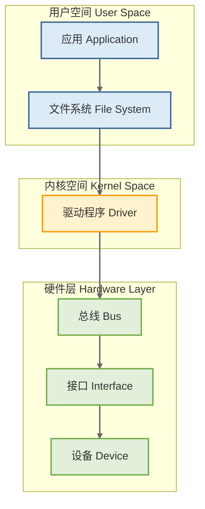

## I/O设备

## 串口、打印机和总线

## 设备驱动程序

虚拟化设备

应用 - 文件 - 驱动 - 总线 - 接口 - 设备 的架构图

```mermaid
graph TD
    A[应用 Application] --> B[文件系统 File System];
    B --> C[驱动程序 Driver];
    C --> D[总线 Bus];
    D --> E[接口 Interface];
    E --> F[设备 Device];

    subgraph 用户空间 User Space
        A
        B
    end

    subgraph 内核空间 Kernel Space
        C
    end

    subgraph 硬件层 Hardware Layer
        D
        E
        F
    end

    style A fill:#DDEBF7,stroke:#336699,stroke-width:2px;
    style B fill:#DDEBF7,stroke:#336699,stroke-width:2px;
    style C fill:#FFF2CC,stroke:#FF9900,stroke-width:2px;
    style D fill:#E2EFDA,stroke:#70AD47,stroke-width:2px;
    style E fill:#E2EFDA,stroke:#70AD47,stroke-width:2px;
    style F fill:#E2EFDA,stroke:#70AD47,stroke-width:2px;

    linkStyle 0 stroke:#666,stroke-width:2px,fill:none;
    linkStyle 1 stroke:#666,stroke-width:2px,fill:none;
    linkStyle 2 stroke:#666,stroke-width:2px,fill:none;
    linkStyle 3 stroke:#666,stroke-width:2px,fill:none;
    linkStyle 4 stroke:#666,stroke-width:2px,fill:none;
```

## 日志
- .ko文件 内核文件

## 问题