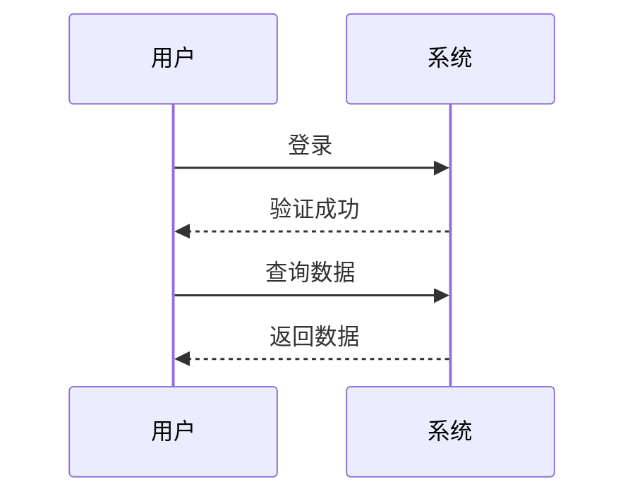
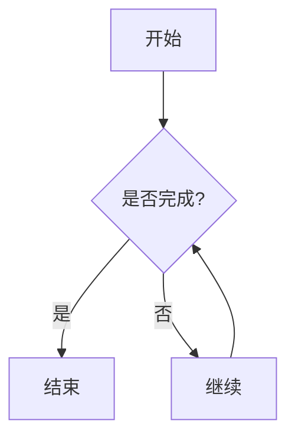

程序vs进程

程序是状态机的静态描述

## testkit.h
一个轻量的c语言测试框架

## fork execve  exit
fork 状态机的完整复制
俩段fork的状态机代码，最终有几个状态机

execve 复位状态机，启动程序

exit 状态机消耗，返回值送回父进程

机器永远是对的，但他出现了一个意外的情况，一定是哪里你没搞清楚
## 其他
托孤进程

## 问题
浅拷贝与深拷贝
markdown画图

bash和Shell之间的关系是什么？
