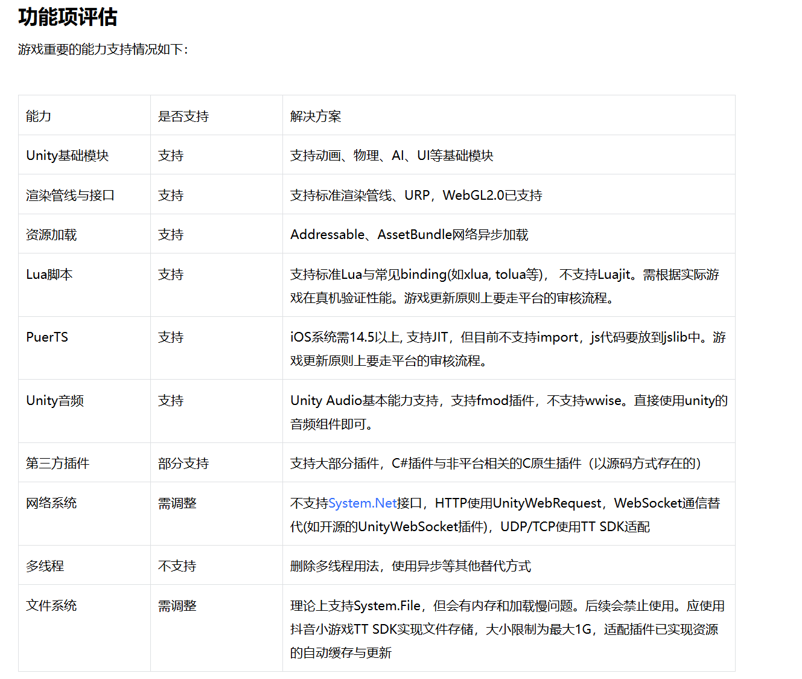

# 前期准备

目标：项目网络部分基础测试
- 前端基础通讯脚本功能
- 后端框架模板部署测试
- 平台接入问题准备

## 

## 问题
- 部署接入问题，如何提供端口给小程序访问，平台如何接受，提供，包体
- 表格制定范式，数据库制表问题
- 前后端通讯协议制定，API文档

### 如何实现自动登录
首先用户在第一次登录的时候，小程序要先让用户同意授权，同意后小程序获得一个临时Code，发送给小程序的后端服务器，  
后端服务器通过这个Code，去调用平台的接口，获得openid和session_key，然后以这俩个数据来为用户注册账户，并返回账户信息，这样便完成了第一次登录注册。

## 学习技能树
核心：ASP.NET，MySQL，Linux，部署服务器
关键：ORM，Linq，Nginx，Docker

非技术：抖音相关文档，前后端协议制定，数据库表的制定

## 学习资料
[微软技术文档](https://learn.microsoft.com/zh-cn/aspnet/core/introduction-to-aspnet-core?view=aspnetcore-8.0)

## 流程分析
目标：为前端提供API服务  
前置准备：阅读抖音文档，制定协商好API方案
实施：
- 制作数据库表格关系
- 编写API逻辑
- 服务器部署测试
- 游戏包体测试

## 上线抖音小游戏的准备研究

### Unity引擎适配
接入问题和前端的关系比较大，比如什么打包，功能接口SDK  
作为后端我只需要提供API管理好数据库，让前端用Webrequest来访问我的接口就行了

## 接入

### 接入相关文档
[接入指南](https://developer.open-douyin.com/docs/resource/zh-CN/mini-game/develop/guide/game-engine/rd-to-SCgame/unity-game-access/sc_access_guide)

TTSDK 客户端接入TTSDK  
TTSDK是什么？  

### 使用Unity WebGL需要的注意事项

### 打包构建
[构建与调试](https://developer.open-douyin.com/docs/resource/zh-CN/mini-game/develop/guide/game-engine/rd-to-SCgame/unity-game-access/sc_build)
安装bgdt package  

使用它们的工具发布

### ​如何发布抖音Unity小游戏​
发布需要以下流程，前面已经讲过如何进行构建，本章将重点介绍如何进行送测：​
1. ​构建：通过 StarkSDKTools 构建（Build）构建与调试。​
2. ​送测：通过 【StarkSDKTools】或【抖音开发者工具】 发布latest 版本，到测试环节。​
3. ​提审：登录 小程序开发者平台，跳转至 【版本管理 】，进行测试，完毕后点击【提交审核】。​
4. ​发布：审核通过之后，登录 小程序开发者平台，跳转至 【版本管理 】，点击【发布】。​

### c# API

###

### WebGl解决方案
使用Unity把项目打包成WebGL发布到抖音平台

### 抖音API